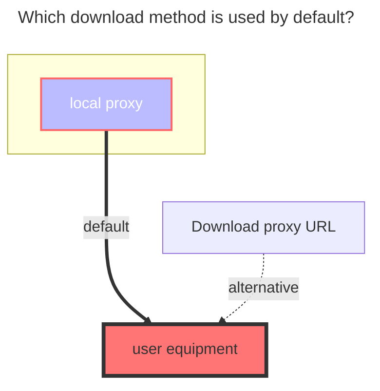
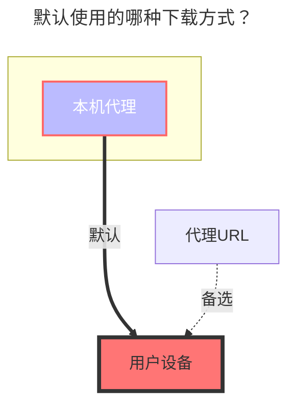

---
title:
  en: STRM
  zh-CN: STRM
icon: iconfont icon-state
top: 120
categories:
  - guide
  - drivers
---

## 关于STRM { lang="zh-CN" }

## About STRM { lang="en" }

::: en
STRM driver monitors specified paths and generates STRM files for media content, enabling streaming playback through local proxy.
:::
::: zh-CN
STRM驱动监控指定路径并为媒体内容生成STRM文件，通过本地代理实现流式播放。
:::

## 路径配置 { lang="zh-CN" }

## Path Configuration { lang="en" }

::: en
One or more paths to monitor, separated by newlines. Format: [name]:[path]

Example:
```
Movies:D:\Media\Movies
Music:/mnt/nas/music
```

Note: If only one path is configured, the system will automatically flatten the directory structure to directly display the contents of that path.
:::
::: zh-CN
一个或多个要监控的路径，每行一个。格式：[名称]:[路径]

示例：
```
电影:D:\媒体\电影
音乐:/mnt/nas/音乐
```

注意：如果只配置了一个路径，系统将自动展平目录结构，直接显示该路径下的内容。
:::

## 站点URL { lang="zh-CN" }

## Site URL { lang="en" }

::: en
The prefix URL for strm file links. If not provided, it will use the system's default API URL.
:::
::: zh-CN
STRM文件链接的前缀URL。如果未提供，将使用系统默认的API URL。
:::

## 文件类型过滤 { lang="zh-CN" }

## File Type Filter { lang="en" }

::: en
File types to be converted to STRM files, separated by commas. Default: strm. Only files with these extensions will be processed and displayed as STRM files.
:::
::: zh-CN
要转换为STRM文件的文件类型，用逗号分隔。默认：strm。只有具有这些扩展名的文件才会被处理并显示为STRM文件。
:::

## 编码路径 { lang="zh-CN" }

## Encode Path { lang="en" }

::: en
Whether to encode the path in the strm file. Default: true
:::
::: zh-CN
是否对STRM文件中的路径进行编码。默认：true
:::

## 启用签名 { lang="zh-CN" }

## Enable Signature { lang="en" }

::: en
Whether to enable path signature for security. Default: false. When enabled, a signature will be generated for the path to prevent unauthorized access.
:::
::: zh-CN
是否启用路径签名以提高安全性。默认：false。启用后，将为路径生成签名以防止未授权访问。
:::

## 支持的媒体类型 { lang="zh-CN" }

## Supported Media Types { lang="en" }

::: en
Video: mp4, mkv, flv, avi, wmv, ts, rmvb, webm
Audio: mp3, flac, aac, wav, ogg, m4a, wma, alac
:::
::: zh-CN
视频：mp4, mkv, flv, avi, wmv, ts, rmvb, webm
音频：mp3, flac, aac, wav, ogg, m4a, wma, alac
:::

## 使用限制 { lang="zh-CN" }

## Usage Limitations { lang="en" }

::: en
The following operations are not supported:
- Creating directories
- Moving files
- Renaming files
- Copying files
- Deleting files
- Uploading files
:::
::: zh-CN
不支持以下操作：
- 创建目录
- 移动文件
- 重命名文件
- 复制文件
- 删除文件
- 上传文件
:::

## 默认使用的下载方式 { lang="zh-CN" }

## The default download method used { lang="en" }

::: en

:::
::: zh-CN

:::